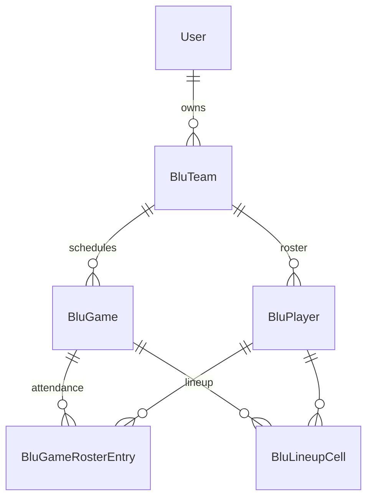

# Baseball Lineup — Data Model (v1)

Schema locked from PRD Q&A. Run migrations after review.

## ER diagram



## Tables

### `blu_team`

| Column | Type | Notes |
|--------|------|-------|
| id | PK | |
| user_id | FK → user | Owner (one coach per team) |
| name | string | e.g. "10U Tigers" |
| season_label | string, nullable | e.g. "Spring 2026" — display only |
| default_inning_count | int | Default 6 |
| settings | JSONB | Lineup structure config — see below |
| created_at, updated_at | datetime | |

#### `settings` JSON shape (v1)

```json
{
  "field_spots_per_inning": 10,
  "position_codes": [
    {"code": "C", "label": "Catcher", "category": "infield"},
    {"code": "1B", "label": "First Base", "category": "infield"},
    {"code": "2B", "label": "Second Base", "category": "infield"},
    {"code": "3B", "label": "Third Base", "category": "infield"},
    {"code": "SS", "label": "Shortstop", "category": "infield"},
    {"code": "LF", "label": "Left Field", "category": "outfield"},
    {"code": "CF", "label": "Center Field", "category": "outfield"},
    {"code": "RF", "label": "Right Field", "category": "outfield"},
    {"code": "P", "label": "Pitcher", "category": "battery"},
    {"code": "PH", "label": "Pitcher Helper", "category": "battery"},
    {"code": "Bench", "label": "Bench", "category": "bench"}
  ],
  "inning_expectations": {
    "1": {
      "field_spots": 10,
      "positions": {"CF": {"min": 2, "max": 2}, "PH": {"min": 1, "max": 1}},
      "categories": {"outfield": {"min": 4, "max": 4}}
    },
    "2": { "...": "same as 1" },
    "3": {
      "field_spots": 10,
      "positions": {"CF": {"min": 2, "max": 2}, "P": {"min": 1, "max": 1}},
      "categories": {"outfield": {"min": 4, "max": 4}}
    },
    "4": { "...": "same as 3" },
    "5": { "...": "same as 1" },
    "6": { "...": "same as 1" }
  }
}
```

**Notes:**

- `inning_expectations` keys are inning numbers as strings (`"1"` … `"6"`).
- Omitted positions/categories are not checked unless present.
- `min`/`max` are inclusive; warn if actual count is below `min` or above `max`.
- A helper can expand “innings 1/2/5/6 share PH config” in the team setup UI without storing redundant UI state differently.

Default template on team create should match Greg’s league (6 innings, 2 CF, 4 OF, 10 field spots, P in 3/4, PH elsewhere) but every value editable.

### `blu_player`

| Column | Type | Notes |
|--------|------|-------|
| id | PK | |
| team_id | FK → blu_team | CASCADE delete |
| first_name | string | |
| last_name | string | |
| sort_order | int | Row order in lineup grid |
| created_at | datetime | |

Display: `first_name` + `last_name`. No cross-team identity. Players are deleted with team or removed from roster explicitly.

### `blu_game`

| Column | Type | Notes |
|--------|------|-------|
| id | PK | |
| team_id | FK → blu_team | |
| game_date | date | |
| opponent_name | string | |
| created_at, updated_at | datetime | |

No per-game settings in v1 — structure comes entirely from `blu_team.settings`.

When created:

1. Seed `blu_game_roster_entry` for every player on roster with `is_present = true`.
2. No lineup cells until coach fills grid.

### `blu_game_roster_entry`

| Column | Type | Notes |
|--------|------|-------|
| id | PK | |
| game_id | FK → blu_game | |
| player_id | FK → blu_player | |
| is_present | bool | Default true |

Unique: `(game_id, player_id)`.

Players added to roster **after** a game was created do not automatically appear in that game’s attendance (only future games unless we add “sync roster” — not v1).

### `blu_lineup_cell`

| Column | Type | Notes |
|--------|------|-------|
| id | PK | |
| game_id | FK → blu_game | |
| player_id | FK → blu_player | |
| inning | int | 1-based |
| position_code | string | e.g. `CF`, `Bench`, `P` |

Unique: `(game_id, player_id, inning)`.

**Not unique:** `(game_id, inning, position_code)` — multiple CF allowed.

Only **present** players participate in the grid and validation.

Missing row for `(game, player, inning)` = **Blank** in UI.

---

## Derived data (computed, not stored)

### Per-player summary (trailing grid columns)

| Column | Rule |
|--------|------|
| Outfield | Count innings where code ∈ {LF, CF, RF} |
| Bench | Count innings where code = `Bench` |
| Infield | Count innings where code ∈ {C, 1B, 2B, 3B, SS} |
| Blank | Count innings with no lineup cell |

Battery (P, PH) counts toward **field** for per-inning field-spot math but is not its own summary column in v1 (matches spreadsheet).

### Per-inning validation

For each inning, aggregate cells for **present** players:

- Field count = codes where category ≠ bench
- Position counts by code
- Category counts

Compare to `team.settings.inning_expectations[inning]`.

---

## Indexes

See `models.py` — `user_id`, `team_id`, `game_id` for list queries.

## Backlog tables (not in v1)

| Table | Purpose |
|-------|---------|
| `blu_lineup_template` | Saved structure presets |
| `blu_player_constraint` | Never catcher, max P innings, etc. |
