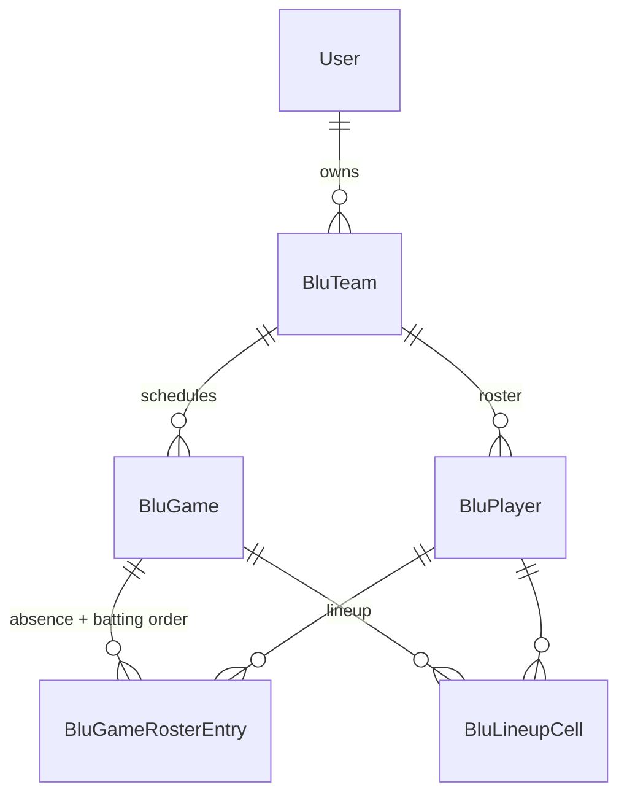

# Baseball Lineup — Data Model (v1)

Schema for PRD v1. Run migrations after review.

## ER diagram



## Two levels of lineup structure

The **game** is the source of truth for how many of each position are expected each inning. The **team** stores a default template that is copied into a game when the game is created. There is no inheritance or override resolution at read time — a game always has its own complete config.

Both levels use the same pair of fields and the same JSON shape, so one editor and one validator serve both.

| Level | Inning count | Expected counts |
|-------|--------------|-----------------|
| Team (default template) | `blu_team.default_inning_count` | `blu_team.default_expected_counts` |
| Game (source of truth) | `blu_game.inning_count` | `blu_game.expected_counts` |

### `expected_counts` JSON shape

Keys are position codes; values are arrays of expected counts indexed by inning (index 0 = inning 1).

```json
{
  "C":  [1, 1, 1, 1, 1, 1],
  "1B": [1, 1, 1, 1, 1, 1],
  "2B": [1, 1, 1, 1, 1, 1],
  "3B": [1, 1, 1, 1, 1, 1],
  "SS": [1, 1, 1, 1, 1, 1],
  "LF": [1, 1, 1, 1, 1, 1],
  "CF": [2, 2, 2, 2, 2, 2],
  "RF": [1, 1, 1, 1, 1, 1],
  "P":  [0, 0, 1, 1, 0, 0],
  "PH": [1, 1, 0, 0, 1, 1]
}
```

**Rules:**

- Every array length equals the sibling inning count. This is the only invariant to enforce on save; changing inning count resizes arrays (grow pads with the last value, shrink drops from the end).
- `Bench` is never a key — bench is whoever is left over after field spots are filled.
- A code omitted entirely is treated as all zeros (that position isn’t used by this team).
- **Field spots for an inning is derived**: sum of that inning’s values across all codes. Never stored, so it cannot drift.
- Values are replaced wholesale on save (assign a new dict rather than mutating in place, since plain `JSONB` columns don’t track in-place mutation).

### Position catalog

The catalog lives in `models.py` as a Python constant, **not** in the database, so it applies uniformly to every existing team:

| Code | Label | Category |
|------|-------|----------|
| C | Catcher | infield |
| 1B | First Base | infield |
| 2B | Second Base | infield |
| 3B | Third Base | infield |
| SS | Shortstop | infield |
| LF | Left Field | outfield |
| CF | Center Field | outfield |
| RF | Right Field | outfield |
| P | Pitcher | infield |
| PH | Pitcher Helper | infield |
| Bench | Bench | bench |

Categories are used only for the per-player summary columns. There are exactly three (`outfield`, `infield`, `bench`) and they partition every code, so a player’s outfield + infield + bench + blank innings always sum to the game’s inning count.

**P and PH are categorized as infield** because that is how the coach totals them by hand. `BATTERY_CODES` exists separately in `lineup_config.py` for grouping those two rows in the structure editor; it has no effect on the summary.

The shipped default template (6 innings, 2 CF, P in innings 3/4, PH elsewhere) matches Greg’s league but every number is editable.

---

## Tables

### `blu_team`

| Column | Type | Notes |
|--------|------|-------|
| id | PK | |
| user_id | FK → user | Owner (one coach per team) |
| name | string | e.g. "10U Tigers" |
| season_label | string, nullable | e.g. "Spring 2026" — display only |
| default_inning_count | int | Default 6 |
| default_expected_counts | JSONB | Template copied into new games |
| created_at, updated_at | datetime | |

A team is one squad for one season. No cross-team player identity.

### `blu_player`

| Column | Type | Notes |
|--------|------|-------|
| id | PK | |
| team_id | FK → blu_team | CASCADE delete |
| first_name | string | |
| last_name | string | |
| sort_order | int | Default row order in the lineup grid |
| created_at | datetime | |

Deleting a player cascades to their roster entries and lineup cells across **all** games, including past ones — the UI confirms with an affected-game count first.

### `blu_game`

| Column | Type | Notes |
|--------|------|-------|
| id | PK | |
| team_id | FK → blu_team | CASCADE delete |
| game_date | date | |
| opponent_name | string | |
| inning_count | int | Copied from team default at create |
| expected_counts | JSONB | Copied from team default at create |
| created_at, updated_at | datetime | |

On create, nothing else is written: no attendance rows (everyone is present by default) and no lineup cells.

### `blu_game_roster_entry`

Per-game exceptions and batting order. **A row is optional.**

| Column | Type | Notes |
|--------|------|-------|
| id | PK | |
| game_id | FK → blu_game | CASCADE delete |
| player_id | FK → blu_player | CASCADE delete |
| is_present | bool | Default true |
| batting_order | int, nullable | Null = unset |

Unique: `(game_id, player_id)`.

**A player is present unless a row exists with `is_present = false`.** Rows are created lazily when the coach marks someone absent or sets a batting order. This is why adding a player to the roster mid-season makes them appear in every game automatically — including games created earlier — with no sync step.

Batting order sorts ascending; players with null sort after, by `blu_player.sort_order`. Ties and gaps are allowed.

### `blu_lineup_cell`

| Column | Type | Notes |
|--------|------|-------|
| id | PK | |
| game_id | FK → blu_game | CASCADE delete |
| player_id | FK → blu_player | CASCADE delete |
| inning | int | 1-based |
| position_code | string | e.g. `CF`, `Bench`, `P` |

Unique: `(game_id, player_id, inning)`. **Not unique:** `(game_id, inning, position_code)` — multiple CF are allowed, and counts are validated against `expected_counts` instead.

- Missing row for `(game, player, inning)` = **Blank** in the UI.
- Only **present** players participate in the grid and validation.
- Cells are retained when a player is marked absent, and when a game’s inning count shrinks (cells beyond the new count are ignored, not deleted, so re-expanding restores prior work).

---

## Derived data (computed, not stored)

### Per-player summary (trailing grid columns)

| Column | Rule |
|--------|------|
| Outfield | Innings where code ∈ {LF, CF, RF} |
| Bench | Innings where code = `Bench` |
| Infield | Innings where code ∈ {C, 1B, 2B, 3B, SS, **P, PH**} |
| Blank | Innings with no lineup cell |

The four columns always sum to the game’s inning count, which makes a row that doesn’t add up a visible sign of a bug. There is no separate battery column, matching the spreadsheet. Computed by `lineup_config.summarize_row`.

### Repeated positions (cell highlighting)

Per player, the codes they fill in more than one inning, via `lineup_config.repeated_positions`. Every cell in a repeat is shaded with a tooltip showing the count. `Bench` is excluded, since repeat bench innings are normal and already visible in the Bench column.

This is presentation only — never stored, never a warning, never blocks a save.

### Per-inning validation (warnings only)

For each inning, aggregate cells belonging to **present** players:

1. Count per position code; warn on any code where actual ≠ `expected_counts[code][inning - 1]`.
2. Warn when present players have no cell for that inning.
3. Warn when the derived field spots for that inning exceed the number of present players.

No per-player warnings in v1.

---

## Indexes

`user_id` on team, `team_id` on player and game, `game_id` on roster entry and lineup cell — all for list queries. Unique constraints as noted above.

## Backlog tables (not in v1)

| Table | Purpose |
|-------|---------|
| `blu_player_constraint` | Never catcher, max P innings, etc. |
