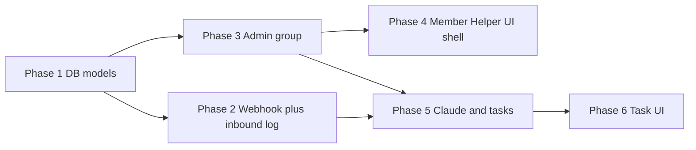

# Helper — Detailed Implementation Plan

## How to use this document

- **[INITIAL_PLAN.md](./INITIAL_PLAN.md)** defines **what** we’re building (behavior, security, schema). This file defines **how to build it in order** and **what to verify** at each step.
- **Phases 1–6** are **delivery Milestones:** complete one phase, run its checks, then move on.
- The section **[Canonical webhook pipeline](#canonical-webhook-pipeline-initial_plan-aligned)** is the **detailed handler recipe** (especially for Mailgun). **Phase numbers inside that section** (Phase 2 vs Phase 5) match this doc’s milestones—they are **not** a second numbering scheme inside a single release.

**Build priority:** **Email → verified webhook → persisted inbound rows** first; **Claude → tasks → UI** once that’s trustworthy.

**Migrations:** You run `flask db migrate` and `flask db upgrade` yourself.

---

## At a glance: milestones

| Phase | Deliverable | Depends on |
| --- | --- | --- |
| **1** | SQLAlchemy models + migration for all five `helper_*` tables | — |
| **2** | `POST /hooks/...` webhook: Mailgun verify, idempotency, inbound + action logging, **no** Claude/tasks | Phase 1 |
| **3** | **Site-admin** UI: create group + members (atomic rules from INITIAL_PLAN) | Phase 1 |
| **4** | **Member** Helper UI: list groups you’re in, empty state | Phase 1, 3 (or seed data) |
| **5** | Claude → `helper_task` + action log on **authorized** inbound mail | Phase 1–3, 2 |
| **6** | Task list, complete, edit **notes** (group-scoped) | Phase 5 |

**Typical path:** **1 → 2** proves the pipe; **3** lets you configure groups without SQL; **3 + 2** enables realistic Mailgun tests; **5–6** finish the product loop.

---

## Traceability: INITIAL_PLAN → milestones

| Topic in INITIAL_PLAN | Where it is built |
| --- | --- |
| Groups, shared list, admin-only create/add | Phase **3** (models in **1**) |
| Recipient → group, unique `inbound_email` | **1**, **2**, **3** |
| Mailgun signature verification | **2**, env vars |
| Sender → `User` + membership; “wrong person” visible | **2** |
| Idempotency key | Column in **1**, logic in **2** |
| Inbound + action logging | **2**, **5** |
| Body: `stripped-text` / `body-plain` | Store in **2**; Claude input in **5** |
| Timezone → `due_date` as **date** only | **5** |
| Claude intents + assignee rules | **5** |
| Tasks + **notes** | **1**, **5**, **6** |
| Fire-and-forget; no attachments | **2**, **5**; defer [below](#explicitly-deferred-from-initial_plan) |
| Webhook URL + `@csrf.exempt` | **2**, [App integration](#app-integration-registry-blueprints) |
| Error table (HTTP **200** + log) | [Webhook pipeline](#canonical-webhook-pipeline-initial_plan-aligned), **2** & **5** |
| Privacy (email content in DB) | [Privacy and access control](#privacy-and-access-control) |
| All DB tables | **1** |
| Deferred (Calendar, …) | [Explicitly deferred](#explicitly-deferred-from-initial_plan) |

---

## Prerequisites (before Phase 1)

- [ ] **Public HTTPS URL** (prod or **ngrok** for dev) — Mailgun must reach your webhook.
- [ ] **Mailgun** account; domain/receiving setup when you send real mail ([INITIAL_PLAN — system components](./INITIAL_PLAN.md#system-components-v1)).
- [ ] **Anthropic API key** — only when you start **Phase 5**.
- [ ] App already has **`DATABASE_URL`**, **Flask-Login**, **`User.time_zone`**, **`User.is_admin`**.

---

## Environment variables

| When | Variable purpose |
| --- | --- |
| Before / during **Phase 2** | **Mailgun** — secrets used to **verify webhook signatures** (see Mailgun docs for the exact signing algorithm and env names). |
| **Phase 5** | **Anthropic** — API key for Claude. |

Load via **`config.py` / `.env`**; never commit secrets.

---

## App integration (registry, blueprints)

Do this as you touch each area (mostly **Phases 1–4**):

| Area | Action |
| --- | --- |
| **`app/__init__.py`** | Import Helper models; register **Helper** blueprint with `url_prefix='/helper'` if not already. |
| **`app/projects/registry.py`** | **helper** entry: `auth_required: True`, URL `/helper`, etc. |
| **Member routes** | `@login_required`; optional **`log_project_visit('helper', …)`**. |
| **Webhook** | Register **`POST /hooks/helper/mailgun`** (or the path in INITIAL_PLAN) **outside** the member-only prefix if needed. Use **`@csrf.exempt`** on that view only. |

The webhook URL must be the **same** one configured in Mailgun Inbound Routes.

---

## High-level dependency graph

- **Phase 2** can be tested **before** Phase 3 (e.g. bad signature, unknown `recipient`).
- For **real** “this inbox + I’m a member” tests, finish **Phase 3** or **seed** `helper_group` / `helper_group_member` in SQL.

---

## Canonical webhook pipeline (INITIAL_PLAN-aligned)

INITIAL_PLAN describes one linear story including Claude. Here we split that story into:

- **Pipeline A — inbound only** (implemented in **Milestone Phase 2** below): persistence and rules **without** LLM or tasks.
- **Pipeline B — Claude + tasks** (implemented in **Milestone Phase 5** below): runs only after inbound pipeline says the sender is an allowed member.

**Important — subject/body on failure paths:** For **`unknown_recipient`**, **`sender_not_allowed`**, etc., the inbound row must still store **subject** and **body_text** for audit (INITIAL_PLAN “wrong person” visibility). Parse **subject** and body (`stripped-text`, else `body-plain`) **from the POST early** and save them on the row **before** you return on those branches—not only on the happy path.

### Pipeline A — inbound only (Milestone Phase 2)

1. **Parse** Mailgun **form** fields: `recipient`, `sender`, `subject`, `stripped-text`, `body-plain`, `message-headers`, `timestamp`, …
2. **Compute `idempotency_key`:** `Message-Id` from `message-headers` (normalized), or **SHA256** of `sender|recipient|timestamp|subject` per INITIAL_PLAN.
3. **Duplicate:** If a row with this key **already exists** → set/update status **`duplicate`**, write **`helper_action_log`**, return **200**, **stop** (Phase 5 must not create a second task either).
4. **Insert** a new **`helper_inbound_email`** row with parsed fields, **`idempotency_key`**, initial **`status`** (e.g. `received`), **`mailgun_timestamp`** if present, and **subject/body_text** as parsed (see note above).
5. **Verify Mailgun signature.** Invalid → **`signature_invalid`**, **`helper_action_log`**, **200**, **stop**.
6. **Resolve `recipient`** (normalized) → **`helper_group`**. None → **`unknown_recipient`**, action log, **200**, **stop** (row already has subject/body).
7. **Resolve `sender`** → **`User`**; check **`helper_group_member`**. Not a user or not in group → **`sender_not_allowed`** (optionally two statuses: unknown user vs not member), action log, **200**, **stop** (row still has audit text).
8. If you reached here, **member is OK** for Pipeline A: ensure **`group_id`**, **`sender_user_id`**, **subject**, **`body_text`** are set; status e.g. **`pending_llm`** — **still no Claude call** until Milestone Phase 5.

### Pipeline B — Claude + tasks (Milestone Phase 5)

9. Build the **Claude** prompt: subject + body + **member names / assignee options** ([INITIAL_PLAN — Claude](./INITIAL_PLAN.md#3-claude-anthropic-api)).
10. Call Claude → expect **JSON**; intents **`add_task`** / **`unknown`**.
11. **`add_task`:** title; optional **due_date** as **date** using **`User.time_zone`**; assignee or default to sender; mismatch → **`assignee_user_id` NULL**.
12. Insert **`helper_task`** (`source_inbound_email_id`, **`notes`** NULL unless you copy from email later).
13. **`helper_action_log`** for success or for **`unknown_intent`**, **`claude_error`**, etc. Failures → **no task**, **200**.

For every handled outcome above, return **HTTP 200** when appropriate so Mailgun does not hammer retries ([error table](./INITIAL_PLAN.md#error-handling-target-behavior)).

---

## Phase 1 — Database models and first migration

**Covers:** [Database tables](./INITIAL_PLAN.md#database-tables-v1-sketch).

**Goal:** All five tables in SQLAlchemy + one Alembic migration.

**Work**

- Add **`app/projects/helper/models.py`** with models mapping to **`helper_group`**, **`helper_group_member`**, **`helper_inbound_email`**, **`helper_action_log`**, **`helper_task`**.
- **Uniques:** `inbound_email` on group; **`(group_id, user_id)`** on membership; **`idempotency_key`** on inbound.
- **Types:** **`due_date`** = **Date** (not datetime); **`notes`** = Text on task; optional **`created_by_user_id`** on group; **`signature_valid`**, **`mailgun_timestamp`**, timestamps per INITIAL_PLAN.
- **Indexes** on inbound (`group_id`, `status`, `created_at`) and tasks as in INITIAL_PLAN.
- Import models in **`app/__init__.py`**.

**You run:** `flask db migrate -m "helper tables"` → `flask db upgrade`

**Verify:** [ ] Migration applies; all tables and FKs present.

---

## Phase 2 — Mailgun webhook + inbound audit

**Covers:** [Email entry](./INITIAL_PLAN.md#email-entry-point), [webhook §2](./INITIAL_PLAN.md#system-components-v1), [Security](./INITIAL_PLAN.md#security-v1), [Logging](./INITIAL_PLAN.md#logging-first-class), [Idempotency](./INITIAL_PLAN.md#idempotency-resolved).

**Goal:** Implement **[Pipeline A — inbound only](#pipeline-a--inbound-only-milestone-phase-2)**: verify signature, log everything, **no** Claude and **no** `helper_task` rows.

**Ops:** Mailgun Inbound Route → `https://<your-host>/hooks/helper/mailgun` (or tunnel).

**Verify**

- [ ] Bad signature → row + status, **200**.
- [ ] Unknown `recipient` → row + status, **200**.
- [ ] Known group, sender **not** allowed → row **with** subject/body visible, **200**.
- [ ] Duplicate idempotency key → **200**, no duplicate processing.
- [ ] **200** for normal handled cases.

---

## Phase 3 — Admin UI: create group + members

**Covers:** [Admin UI](./INITIAL_PLAN.md#5-admin-ui-site-admin-only), [Group creation](./INITIAL_PLAN.md#group-creation-resolved).

**Goal:** **`admin_required`** only. One transaction: **name**, **unique inbound_email**, **≥1 member**, **admin’s email in the list**, **every email = existing User** — else rollback and show which emails failed.

**Work**

- Set **`created_by_user_id`** on the group.
- Optional: “Add member” form for existing groups (same rules).
- **Ops reminder:** New `inbound_email` usually needs a **new Mailgun route** to the same webhook URL ([Mailgun](./INITIAL_PLAN.md#system-components-v1)).

**Verify**

- [ ] Invalid data → **no** partial rows.
- [ ] Stored `inbound_email` **matches** Phase 2 normalization of Mailgun `recipient`.

---

## Phase 4 — Member Helper UI (shell)

**Covers:** [Overview / groups](./INITIAL_PLAN.md#overview).

**Goal:** **`@login_required`**. Show groups where **`current_user`** is a **member**. Empty state: explain an **admin** must add them.

**Work:** Templates use **`helper-` CSS prefix** (avoid collisions with other projects).

**Verify:** [ ] Member sees group(s); non-member sees empty state.

---

## Phase 5 — Claude + tasks (email path)

**Covers:** [Claude](./INITIAL_PLAN.md#3-claude-anthropic-api), [Tasks](./INITIAL_PLAN.md#4-task-tracker-shared-per-group), [Supported actions](./INITIAL_PLAN.md#supported-actions-v1), [Timezone](./INITIAL_PLAN.md#timezone).

**Goal:** Implement **[Pipeline B — Claude + tasks](#pipeline-b--claude--tasks-milestone-phase-5)** only when inbound mail has passed Pipeline A as an **authorized member**.

**Work:** Anthropic env; strict JSON; handle **`unknown`** and API errors with logs and **no** task; task insert failure → log, **200**.

**Verify**

- [ ] Supported-action examples behave as in INITIAL_PLAN.
- [ ] **`unknown` / errors** → no task row; audit trail intact.

---

## Phase 6 — Task UI

**Covers:** [Task tracker](./INITIAL_PLAN.md#4-task-tracker-shared-per-group), [`helper_task`](./INITIAL_PLAN.md#5-helper_task).

**Goal:** Members **list** / **complete** tasks and edit **`notes`**; **authorize** by **`group_id`** membership.

**Verify**

- [ ] Two members in one group both see that group’s tasks; **no** cross-group access.
- [ ] **Completed by** / **completed_at** updated correctly.

---

## Optional — Admin inbound log viewer

**Site-admin-only** read-only list of **`helper_inbound_email`** rows — supports [logging](./INITIAL_PLAN.md#logging-first-class) and [privacy](./INITIAL_PLAN.md#privacy-stored-email-content) expectations. Can ship after Phase **2**.

---

## Privacy and access control

See [INITIAL_PLAN — Privacy](./INITIAL_PLAN.md#privacy-stored-email-content). **Inbound subject/body** are sensitive: restrict who can query them (e.g. admin-only global list; members never see other groups’ mail unless you explicitly allow).

---

## Explicitly deferred (from INITIAL_PLAN)

Per [Deferred](./INITIAL_PLAN.md#deferred-after-v1) and [not locked](./INITIAL_PLAN.md#what-you-dont-need-to-lock-now):

- Google Calendar, confirmation email, attachment processing, group delete/rename/remove member, threaded comments, **`raw_payload`**, rate limits / job queues — unless you pull a item forward.

**Future attachments:** separate attachment table + object storage (not v1).

---

## Testing and operations

- Compare **Mailgun** dashboard logs with **`helper_inbound_email`** (recipient, time). Mismatch → DNS, route pattern, or webhook URL.
- Signature failures → verify signing secret and Mailgun’s verification steps (including **timestamp** skew).
- **Idempotency:** same message retried → **one** task (duplicate handled in Phase 2).

---

## Document maintenance

1. Update **[INITIAL_PLAN.md](./INITIAL_PLAN.md)** when behavior changes.
2. Update **this file** so phases and checklists stay accurate.
