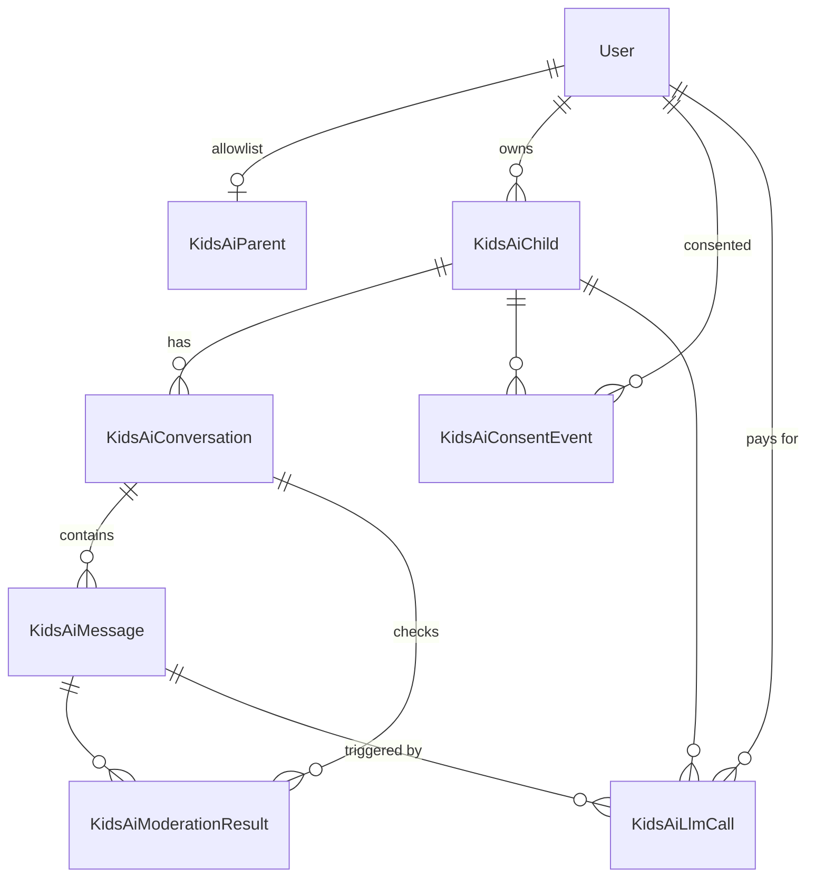

# Kids AI — Data Model (v1)

Schema for [initial_prd.md](./initial_prd.md). Review this before any migration. Children are **not** rows in `user`.

Table prefix: `kids_ai_`. Python classes: `KidsAi*`.

---

## ER diagram

---

## Not in the database

- **Child session.** Signed Flask cookie (separate cookie name from the hub session). Stores `child_id` only. On each request: child exists, `enabled`, and parent still has a `kids_ai_parent` row (or send is also blocked when `paused`). No session table.
- **Credits.** Stay on `user.credits` (the parent). No Kids AI credit table. Credits are not the same as API cost.
- **Prompts and model IDs.** Hardcoded in v1.
- **Digest send log.** None. The 8:00 job sends once per parent with activity; a rare double-run can double-email.

---

## Tables

### `kids_ai_parent`

Admin allowlist. One row = this hub user may use the parent dashboard and their kids may log in.

| Column | Type | Notes |
|--------|------|-------|
| id | PK | |
| user_id | FK → `user.id`, unique | The parent |
| created_at | datetime | |
| created_by_user_id | FK → `user.id`, nullable | Admin who allowlisted them |

Deleting this row is “remove from allowlist”: dashboard goes away, kids cannot log in. **Do not** cascade-delete children or conversations.

---

### `kids_ai_child`

Kids AI-only identity. `parent_user_id` points at `user`, not at `kids_ai_parent`, so children survive allowlist removal.

| Column | Type | Notes |
|--------|------|-------|
| id | PK | |
| parent_user_id | FK → `user.id` | Owner; one parent per child |
| username | string(20) | Stored lowercase. Unique. `[a-z0-9_]`, 3–20 chars |
| password_hash | string(256) | Werkzeug hash; parent sets/resets |
| display_name | string(50) | Required, 1–50, not unique |
| age_tier | string(20) | `young_child` \| `tween` \| `teen` |
| enabled | bool | Default true. False = cannot log in (parent disable) |
| lock_count | int | Default 0. Flagged conversations since last unpause |
| paused | bool | Default false. True after `lock_count` reaches 3 |
| created_at | datetime | |
| updated_at | datetime | |

**Login:** username match is exact on the stored lowercase value. `enabled` must be true **and** a `kids_ai_parent` row must exist for `parent_user_id`.

**Send / new conversation:** also `paused` must be false, and parent `user.credits >= 1`.

**Allow chatting again:** set `paused = false`, `lock_count = 0`. Locked conversations stay locked.

**Indexes:** unique `username`; index `parent_user_id`.

Username is immutable after create. No delete-child in v1.

---

### `kids_ai_consent_event`

COPPA log. Creating a child writes one row. **Not** deleted by the 30-day conversation job or by parent conversation deletes.

| Column | Type | Notes |
|--------|------|-------|
| id | PK | |
| parent_user_id | FK → `user.id` | Who consented |
| child_id | FK → `kids_ai_child.id` | |
| username | string(20) | Snapshot at event time |
| display_name | string(50) | Snapshot |
| age_tier | string(20) | Snapshot |
| created_at | datetime | Consent timestamp |

v1 event is always “child created.” Age-tier changes later are settings, not a second consent row.

**Indexes:** `child_id`; `parent_user_id`.

---

### `kids_ai_conversation`

| Column | Type | Notes |
|--------|------|-------|
| id | PK | |
| child_id | FK → `kids_ai_child.id` | CASCADE if a child row is ever removed |
| title | string(120), nullable | Model label, or truncated first message |
| title_source | string(20), nullable | `model` \| `truncated` |
| locked | bool | Default false. Permanent in v1 |
| running_summary | text, nullable | Latest Pass 2 summary (daily digest) |
| last_flag_concern | text, nullable | Plain-English concern for the parent email |
| pass2_pending | bool | Default false. Child UI polls this; send stays disabled while true |
| created_at | datetime | |
| modified_at | datetime | Bumped on every message write; retention key |

**Kid list:** `locked = false`, newest `modified_at` first.

**Lock:** set `locked = true`, increment child’s `lock_count`, set `paused` if `lock_count >= 3`, store `last_flag_concern`.

**Retention:** daily job hard-deletes rows with `modified_at` older than 30 days (cascades messages + moderation results). Parent delete is the same hard delete, immediate.

**Indexes:** `(child_id, modified_at)`; `(child_id, locked)`.

---

### `kids_ai_message`

| Column | Type | Notes |
|--------|------|-------|
| id | PK | |
| conversation_id | FK → `kids_ai_conversation.id` | CASCADE delete |
| role | string(20) | `child` \| `assistant` |
| body | text | Child max 2,000 chars enforced in the app |
| created_at | datetime | |

**Indexes:** `(conversation_id, created_at)`.

Primary Claude sees all messages in the conversation. Moderators see `running_summary` plus the last ~20 messages plus the new turn.

---

### `kids_ai_moderation_result`

One row per model per pass. Flag / concern / summary / error only — **not** the child’s or assistant’s message text (that lives on `kids_ai_message`). Used to iterate prompts and to pick the parent-email concern and stored summary.

| Column | Type | Notes |
|--------|------|-------|
| id | PK | |
| conversation_id | FK → `kids_ai_conversation.id` | CASCADE delete |
| child_message_id | FK → `kids_ai_message.id` | The child turn this check is about |
| assistant_message_id | FK → `kids_ai_message.id`, nullable | Set on Pass 2 after the reply exists |
| pass_number | int | `1` or `2` |
| model | string(80) | e.g. `gemini-3.5-flash-lite`, `gpt-5.6-luna` |
| flagged | bool, nullable | Null if the call errored |
| concern | text, nullable | If flagged |
| summary | text, nullable | Pass 2 only |
| error | text, nullable | Timeout/API failure; do not treat as a flag |
| created_at | datetime | |

Pass 1 outage (error, no flag): fail closed, no Claude, no credit, no lock.  
Pass 2 outage: log here, `pass2_pending = false`, do not lock.

**Indexes:** `(conversation_id, created_at)`; `child_message_id`.

---

### `kids_ai_llm_call`

Every provider call, with tokens and estimated USD. This is the admin cost ledger. **No prompt or response text** — so it does not leak transcripts (admins still cannot view conversations).

Does **not** cascade away with the 30-day / parent conversation delete. `conversation_id` and `child_message_id` SET NULL if those rows go away; `parent_user_id` and `child_id` stay so you can still total by parent and kid.

| Column | Type | Notes |
|--------|------|-------|
| id | PK | |
| parent_user_id | FK → `user.id` | Whose credits / family this is |
| child_id | FK → `kids_ai_child.id` | |
| conversation_id | FK → `kids_ai_conversation.id`, nullable | SET NULL on conversation delete |
| child_message_id | FK → `kids_ai_message.id`, nullable | The kid turn that triggered this call; SET NULL if messages are deleted |
| kind | string(20) | `pass1` \| `primary` \| `pass2` \| `title` |
| model | string(80) | Exact model id |
| input_tokens | int, nullable | From the provider usage block |
| output_tokens | int, nullable | |
| input_cost_usd | numeric(12, 6), nullable | Estimated at call time from a hardcoded price table |
| output_cost_usd | numeric(12, 6), nullable | |
| error | text, nullable | If the call failed; still store a row when we know the model/kind |
| created_at | datetime | |

**Indexes:** `(parent_user_id, created_at)`; `(child_id, created_at)`; `(child_message_id)`; `(kind, created_at)`.

**Admin UI (hub `/admin`, not the parent dashboard):** totals across parents, per parent, per child, per `kind`, and drill-down to the calls for one `child_message_id` (Pass 1 ×2, primary, Pass 2 ×2, title if any). No message bodies on that screen.

**Pricing:** `app/projects/kids_ai/pricing.py` (`PRICING`, USD per 1M tokens). Applied when usage metadata comes back. Historical rows keep the dollars we stored; we do not reprice old calls.

| Model | Input / 1M | Output / 1M |
|-------|------------|-------------|
| `claude-sonnet-5` | $2.00 | $10.00 |
| `gemini-3.5-flash-lite` | $0.30 | $2.50 |
| `gpt-5.6-luna` | $0.20 | $1.20 |

A normal successful kid message is typically **5 rows** (2× Pass 1 + primary + 2× Pass 2). Title adds a 6th on the first completed exchange. Pass 1 block: 2 rows, no primary.

---

## Write path (one child send)

1. Load child + parent `User`. Refuse if not enabled, paused, parent not allowlisted, or `credits < 1`.
2. Insert `kids_ai_message` (`role=child`). Bump `conversation.modified_at`. Set `pass2_pending = true` only after a reply is shown; during Pass 1 it can stay false until Claude returns.
3. Pass 1 → two `kids_ai_moderation_result` rows **and** two `kids_ai_llm_call` rows (`kind=pass1`). If either `flagged`: lock conversation, bump `lock_count`, maybe `paused`, email parent. No credit. Title = truncated body if this was the first message.
4. If Pass 1 clear: `parent.credits -= 1` (existing exhaust listener). Call Claude. Insert assistant message + `kids_ai_llm_call` (`kind=primary`). Show full reply. Set `pass2_pending = true`.
5. If this is the first completed exchange and title is still null: title via `gemini-3.5-flash-lite`, `title_source = model`, plus `kids_ai_llm_call` (`kind=title`).
6. Pass 2 → two result rows + two `kids_ai_llm_call` rows (`kind=pass2`). Store `running_summary` (prefer unflagged model’s summary). If either flagged: lock + email. Set `pass2_pending = false` (also on Pass 2 error).

---

## Age tier values

| Stored | PRD label | Ages |
|--------|-----------|------|
| `young_child` | Young Child | 5–8 |
| `tween` | Tween | 9–12 |
| `teen` | Teen | 13–17 |

---

## Cascade / delete rules

| Action | Effect |
|--------|--------|
| Remove parent allowlist | Delete `kids_ai_parent` only |
| Parent deletes a conversation | Hard-delete conversation → messages + moderation results. `kids_ai_llm_call` rows stay; conversation/message FKs null out |
| 30-day job | Same as parent delete, by `modified_at` |
| Parent deletes all conversations for a child | All of that child’s conversations (cost rows stay) |
| Disable child | `enabled = false` only |
| Unpause | `paused = false`, `lock_count = 0` |
| Delete hub `User` | Should be rare; FK restrict (do not silently orphan without a decision). Not a v1 UI. |

Consent events and `kids_ai_llm_call` rows are kept.

---

## Out of scope for this schema

- Linking a child to a `user` row
- Per-thread unlock
- Second parent on a child
- Request-credits table
- Editable prompt versions
