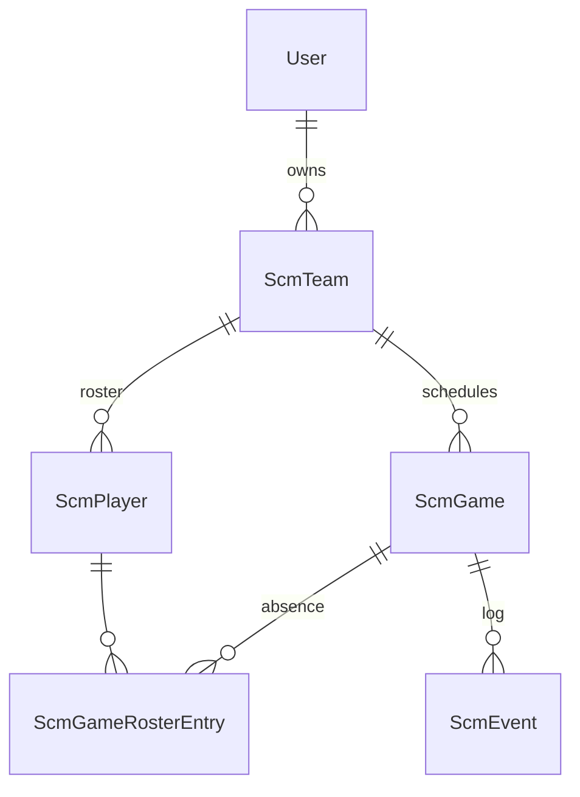

# Soccer Minutes — Data Model (v1)

Schema for PRD v1. Run migrations after review. See [`PRD.md`](PRD.md) for product behavior.

## ER diagram



Minutes, current field, and open stints are **derived** by replaying `scm_event` rows. They are never stored.

## Two levels of formation

The **game** is the source of truth for slots and period count. The **team** stores a default template that is copied into a game when the game is created. There is no inheritance or override resolution at read time.

| Level | Period count | Formation |
|-------|--------------|-----------|
| Team (default template) | `scm_team.period_count` | `scm_team.formation` |
| Game (source of truth) | `scm_game.period_count` | `scm_game.formation` |

Editing team defaults never mutates existing games. After a game’s first `period_start` event, that game’s formation and period count are locked.

## Formation JSON shape

An ordered list of slots. Keys are stable; **names** are what the coach types.

```json
{
  "slots": [
    {"key": "fwd_0", "group": "fwd", "name": "ST"},
    {"key": "mid_0", "group": "mid", "name": "LM"},
    {"key": "mid_1", "group": "mid", "name": "CM"},
    {"key": "mid_2", "group": "mid", "name": "RM"},
    {"key": "def_0", "group": "def", "name": "LB"},
    {"key": "def_1", "group": "def", "name": "RB"},
    {"key": "gk",    "group": "gk",  "name": "GK"}
  ]
}
```

**Rules:**

- `group` is one of `gk`, `def`, `mid`, `fwd`.
- Exactly one slot with `group = gk` and `key = gk`.
- Other keys are `{group}_{n}` with `n` a 0-based index in that group (`def_0`, `def_1`, …).
- Display order on the pitch, left → right within a band, is the order of slots **in that group** as stored in the array. The array itself may be grouped FWD then MID then DEF then GK (pitch top to bottom attacking left-to-right) or any order; readers should filter by group rather than assume a global sort.
- **Field size** is `len(slots)`. Never stored separately.
- Increasing a group’s count appends a new slot at the end of that group with a placeholder name (`DEF 3`, etc.). Decreasing drops the last slot of that group. Only allowed when the game has no `period_start` yet (team defaults: always allowed).
- Renaming a slot changes `name` only; `key` stays. Events always reference `key`.
- Replace the JSON wholesale on save (assign a new dict). Plain `JSONB` columns do not track in-place mutation.

### Shipped default (7v7, 2-3-1)

One GK, 2 DEF, 3 MID, 1 FWD, names as in the example above. A 9v9 team edits counts to 3-3-2 (or whatever) on the team.

### Groups

Used for pitch bands and for minute rollups. They partition every slot:

| Group | Band on pitch (top = attack) |
|-------|------------------------------|
| `fwd` | Forwards |
| `mid` | Midfield |
| `def` | Defense |
| `gk`  | Goalkeeper |

---

## Tables

### `scm_team`

| Column | Type | Notes |
|--------|------|-------|
| id | PK | |
| user_id | FK → user | Owner (one coach per team) |
| name | string | e.g. "9U United" |
| season_label | string, nullable | e.g. "Fall 2026" — display only |
| period_count | int | Default 2 |
| formation | JSONB | Template copied into new games |
| created_at, updated_at | datetime | |

A team is one squad for one season.

### `scm_player`

| Column | Type | Notes |
|--------|------|-------|
| id | PK | |
| team_id | FK → scm_team | CASCADE delete |
| first_name | string | |
| last_name | string | |
| jersey_number | string, nullable | Optional; not unique. String so "00" and "1A" work. |
| sort_order | int | Default order on bench / roster |
| created_at | datetime | |

Deleting a player removes them from draft assignments and from events in **all** games, including past ones — the UI confirms with a count of affected games first (same idea as baseball lineup). Before delete: strip their id out of `draft_assignments` on every game, then delete any event whose payload names them. That distorts history if you delete mid-season; the confirm dialog is the warning.

### `scm_game`

| Column | Type | Notes |
|--------|------|-------|
| id | PK | |
| team_id | FK → scm_team | CASCADE delete |
| game_date | date | |
| opponent_name | string | |
| period_count | int | Copied from team at create |
| formation | JSONB | Copied from team at create |
| draft_assignments | JSONB | `{slot_key: player_id}` for pre-kickoff and between periods. Empty object default. |
| pending_assignments | JSONB | Pending field map `{slot_key: player_id}`, cloned from live. Null or equal to live = nothing staged. Cleared / recopied on Go, Reset, or period end. |
| current_period | int | 1-based; which period the clock refers to |
| clock_running | bool | Default false |
| elapsed_ms | int | Elapsed in `current_period` as of last pause (or 0) |
| last_resumed_at | datetime, nullable | UTC wall time of last start/resume; null when not running |
| created_at, updated_at | datetime | |

On create, nothing else is written: no attendance rows, no events, empty draft.

**Displayed elapsed while running:** `elapsed_ms + (utcnow() - last_resumed_at)` in ms. **While paused:** `elapsed_ms`.

`from_team_defaults(team, game_date, opponent_name)` copies `period_count` and `formation`.

### `scm_game_roster_entry`

Per-game absence. **A row is optional.**

| Column | Type | Notes |
|--------|------|-------|
| id | PK | |
| game_id | FK → scm_game | CASCADE delete |
| player_id | FK → scm_player | CASCADE delete |
| is_present | bool | Default true |

Unique: `(game_id, player_id)`.

**A player is present unless a row exists with `is_present = false`.** Rows are created lazily when the coach marks someone absent. Adding a player to the roster mid-season makes them appear in every game automatically.

Marking absent also removes that player from `draft_assignments` for the game.

### `scm_event`

| Column | Type | Notes |
|--------|------|-------|
| id | PK | |
| game_id | FK → scm_game | CASCADE delete |
| period | int | 1-based |
| at_ms | int | Game-clock time into that period (≥ 0) |
| type | string | `period_start` \| `field_set` \| `period_end` |
| payload | JSONB | Shape depends on type |
| created_at | datetime | Insert order for undo (newest `id` / `created_at`) |

Index on `game_id`. No uniqueness on `(game_id, period, at_ms)` — two events at the same stamp are ordered by `id`.

**Undo:** delete the event with the greatest `id` for that game. Then recompute draft/clock as needed (`period_end` undo → period in progress; `period_start` undo of period 1 → back to draft, clock 0, not running).

**Edit time:** update `at_ms` only. Must satisfy, within that period: previous event’s `at_ms` ≤ this `at_ms` ≤ next event’s `at_ms` (or period length if this is `period_end` / last event).

#### Payload shapes

**`period_start`**

```json
{"assignments": {"gk": 12, "def_0": 4, "def_1": 7, "mid_0": 2, "mid_1": 9, "mid_2": 1, "fwd_0": 5}}
```

Missing keys = empty slot. Values are `scm_player.id`. Snapshot of `draft_assignments` at kickoff / next-period start.

**`field_set`** (written only when the coach taps **Go**)

```json
{"assignments": {"gk": 12, "def_0": 4, "def_1": 3, "mid_0": 11, "mid_1": 9, "mid_2": 1, "fwd_0": 5}}
```

Same shape as `period_start`: the **full** field after this stoppage. Missing keys = empty slot. Replay replaces the live field at `at_ms`. The UI diff (who came on/off/moved) is computed by comparing this map to the previous field; it is not stored.

**`period_end`**

```json
{}
```

`at_ms` is the period length as recorded.

Pause / resume are **not** events.

---

## Draft assignments JSON

On `scm_game.draft_assignments`:

```json
{"gk": 12, "def_0": 4, "fwd_0": 5}
```

- Keys are slot keys from the game’s formation. Unknown keys ignored.
- Values are player ids who are **present**.
- A player appears in at most one slot.
- Between periods, this is the field the coach is editing; `period_start` copies it into the event.

## Pending assignments JSON

On `scm_game.pending_assignments` (not an event, not minutes). Same shape as `draft_assignments`.

When staging starts (or after kickoff), this is a **clone of the live field**. Edits mutate only this copy. **Go** writes it into a `field_set` and clones live again. **Reset** copies live onto it. Null / omitted / deep-equal to live means Go is disabled.

---

## Derived data (computed, not stored)

### Current field

Replay all events for the game in `(period, id)` order. After the last event:

- If the last event of the current period is `period_end` (or no `period_start` yet): current field = `draft_assignments`.
- Else: field = result of replay through the latest event.

### Stints

For each period, walk that period’s events and emit `(player_id, slot_key, period, start_ms, end_ms)` as in PRD §7.

### Per-game minutes

For each present player:

- Total on-field ms (sum of stints)
- Per group (`gk` / `def` / `mid` / `fwd`)
- Per slot key (and display using current game formation names)

Absent players are omitted.

### Season minutes

Same sums across all games on the team. Per-slot grouping by **slot name string** (see PRD §7).

---

## Clock invariants

- `clock_running` implies `last_resumed_at` is set.
- Not running implies `last_resumed_at` is null; `elapsed_ms` is the frozen value.
- `current_period` is `1 .. period_count`. Starting period N requires period N-1 to have a `period_end` (except N = 1).
- Ending a period sets `clock_running = false`, `elapsed_ms = at_ms` of that `period_end`, `last_resumed_at = null`.
- **Set clock** to T ms: `elapsed_ms = T`. If running, also `last_resumed_at = now`. `T` must be ≥ the max `at_ms` of events already in this period.

---

## Indexes

`user_id` on team, `team_id` on player and game, `game_id` on roster entry and event. Unique `(game_id, player_id)` on roster entry.

## Backlog (not in v1)

| Idea | Purpose |
|------|---------|
| Late-arrival events | Open a “available from” window so bench time is not implied from 0:00 |
| Event rewrite | Change who was involved, not just `at_ms` |
| Stint table | Materialize if replay ever gets slow (it will not at youth-game size) |
